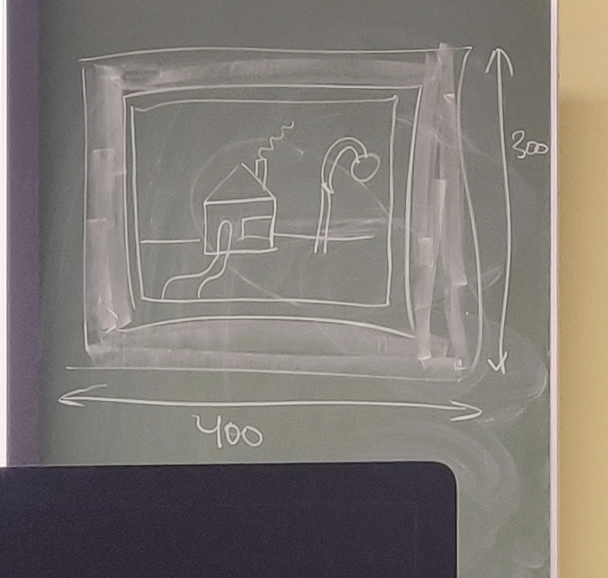

# Mon Premier Canvas
> Un exercice réalisé pour le cours de `Multimédia` donné à la  [Haute École de La Province de Liège - Bachelier en Techniques Graphiques](https://www.provincedeliege.be/fr/art560).
* * *

Le rendu devra ressembler à ceci :

- Il faudra également rendre le tout **responsive** :
    * Tout dessiner par rapport au centre
    * ne pas utiliser de données explicites 
